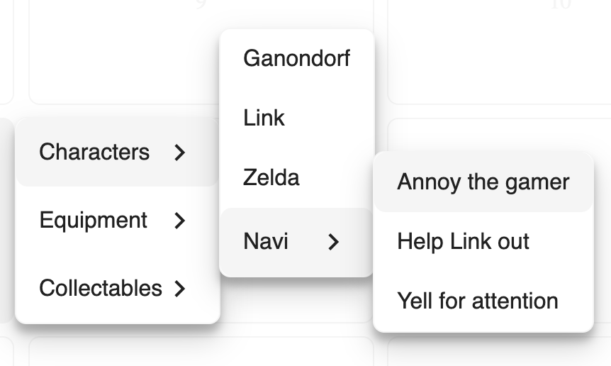

[](https://travis-ci.com/Fabriquartz/ember-right-click-menu)
[](https://emberobserver.com/addons/ember-right-click-menu)
[](https://codeclimate.com/github/Fabriquartz/ember-right-click-menu/maintainability)

Ember Right Click Menu
==============================================================================

An easy and flexible addon to add context menus anywhere in your application

Compatibility
------------------------------------------------------------------------------

This addon is made for Ember Octane, with glimmer components


Installation
------------------------------------------------------------------------------

```
ember install ember-right-click-menu
```

Setup
------------------------------------------------------------------------------
The right click menu needs some styling, which must be included manually. Add one of the following imports to your application. If you don't want any custom styling and style the right click menu on your own, you can just import the default.

```css
  @import 'ember-right-click-menu';
  @import 'ember-right-click-menu-default'; /* without any additional styling */
```

If you don't want to include material icons, you can add the following lines to your styling instead

```css
.ember-right-click-menu {
  display: none;
}

.ember-right-click-menu[data-show] {
  display: block;
}
```

In oder to make the context-menu work, you need to include the following line in your application. For example in the index.html or application.hbs.

```hbs
<div id="ember-right-click-menu-wormhole"></div>
```

Preview
------------------------------------------------------------------------------


Live demo: https://fabriquartz.github.io/ember-right-click-menu/

Usage
------------------------------------------------------------------------------

The right click menu will be applied to its parent element. Options for the right click menu are added via a simple list of objects that contain a name, an action and a property to make it disabled. You can nest options to create a multi level context menu.
```js
items = [
  { title: "Link", action: this.saveHyrule },
  { title: "Zelda", action: this.petEpona, disabled: true },
  { title: "Navi", items: [
    { title: "Annoy the gamer", action: this.sayHeyListen },
    { title: "Help Link out", action: this.sayHeyListen },
    { title: "Yell for attention", action: this.sayHeyListen },
  ]}
]

```
```hbs
<span>
  Element with context menu
  <RightClickMenu @items={{this.items}} />
</span>
```

Contributing
------------------------------------------------------------------------------

See the [Contributing](CONTRIBUTING.md) guide for details.


License
------------------------------------------------------------------------------

This project is licensed under the [MIT License](LICENSE.md).
